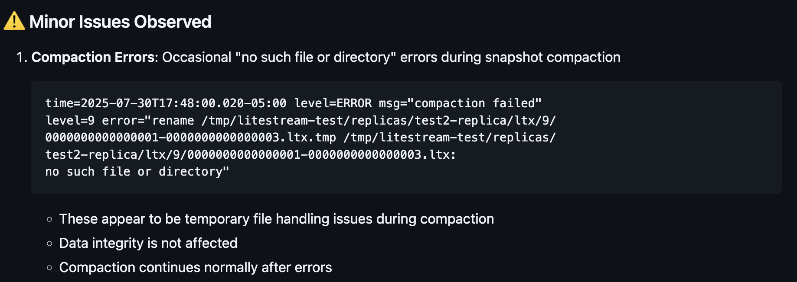
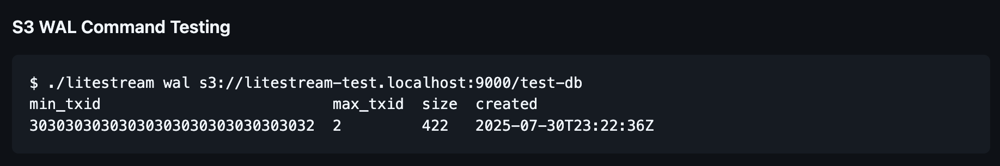

# Litestream LTX TODO List

Based on feedback from Ben Johnson on July 30, 2025.

## High Priority Fixes

### 1. [ ] Fix Command-line Replication Default Interval Bug ([#669](https://github.com/benbjohnson/litestream/issues/669))

**Issue**: Command-line replication without config file causes continuous snapshots instead of using 24h default interval  
**Details**: When using `litestream replicate db.db s3://bucket/path` without a config file, snapshot interval defaults to 0s causing continuous snapshots  
**Expected**: Should use 24h default snapshot interval

### 2. [ ] Fix Compaction File Handling Errors ([#670](https://github.com/benbjohnson/litestream/issues/670))

**Issue**: Occasional "no such file or directory" errors during snapshot compaction  
**Details**: Temporary file handling issues during compaction at level 9  
**Note**: Data integrity is not affected, but the errors should be resolved

## Command Updates

### 3. [ ] Rename `litestream wal` command to `litestream ltx` ([#671](https://github.com/benbjohnson/litestream/issues/671))

**Task**: Update the command name from `wal` to `ltx` to better reflect that it's now listing LTX files  
**Files to update**:

- Command registration
- Help text
- Documentation
- Examples

### 4. [ ] Fix TXID Display Formatting ([#672](https://github.com/benbjohnson/litestream/issues/672))

**Issue**: TXID values are not displaying in proper hex format  
**Task**: Update all CLI commands to display TXID as `ltx.TXID.String()` which formats as `%016x`  
**Current**: Shows as decimal `30303030303030303030303030303032`  
**Expected**: Should show as hex like `0000000000000002`

### 5. [ ] Fix TXID Parsing for CLI Arguments ([#673](https://github.com/benbjohnson/litestream/issues/673))

**Task**: Find all places accepting TXID as CLI arguments and ensure using `ltx.ParseTXID` function  
**Note**: This ensures consistent TXID format handling across all commands

## Infrastructure Updates

### 6. [ ] Upgrade AWS S3 Client from v1 to v2 ([#674](https://github.com/benbjohnson/litestream/issues/674))

**Current**: Using v1 of AWS S3 SDK  
**Task**: Upgrade to AWS SDK Go v2 for S3 operations  
**Benefits**: Better performance, updated features, ongoing support

## Community Contributions

### 7. [ ] Review and Address GitHub Issues ([#675](https://github.com/benbjohnson/litestream/issues/675))

**Task**: Go through open GitHub issues and find low-hanging fruit to address  
**Repository**: [https://github.com/benbjohnson/litestream/issues](https://github.com/benbjohnson/litestream/issues)

### 8. [ ] Review Open Pull Requests ([#676](https://github.com/benbjohnson/litestream/issues/676))

**Task**: Review community pull requests and help merge or provide feedback  
**Repository**: [https://github.com/benbjohnson/litestream/pulls](https://github.com/benbjohnson/litestream/pulls)

## Progress Tracking

- [ ] All high priority fixes completed
- [ ] All command updates completed  
- [ ] AWS SDK upgrade completed
- [ ] Community contributions reviewed

## Notes

- Focus on backward compatibility when making changes
- Test all changes thoroughly with both file and S3 replication
- Update documentation as needed for any user-facing changes
